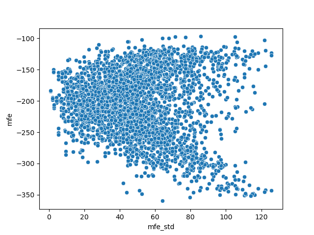

# RNA_scaffold_generation

we tried to generate candidate scaffolds from a set of elements according to the following described structure and rules:

1. the structure of the synthesis fragments

```
     `fixed U6 promoter 3' 20bp`-gRNA-scaffold-linker promoter-gRNA-scaffold-linker
               linker + promoter-gRNA-scaffold-linker promoter-gRNA-scaffold-linker
               linker + promoter-gRNA-scaffold-linker promoter-gRNA-scaffold-linker
               ...
               linker + promoter-gRNA-scaffold-linker promoter-gRNA-`fixed SF 5' 20bp`
```

2. no 19 mer based on [TwistBio](https://www.twistbioscience.com/)

3. products' LENGTH range within 0.3kb - 1.8kb

we wanted to find out why the synthesis of certain products that totally abide by the above rules still fail. That's why we try to predict the minimum free energy (mfe) and secondary structure of the products. 



# TODO

[] rather than randomly pick up elements, we should try to list all possible combinations of elements

[] expand the properties to examine in the future, or other way to find out the secret that cause synthesis failure

[] make the update of submission or available elements as a web service so that we can collect more data more easily